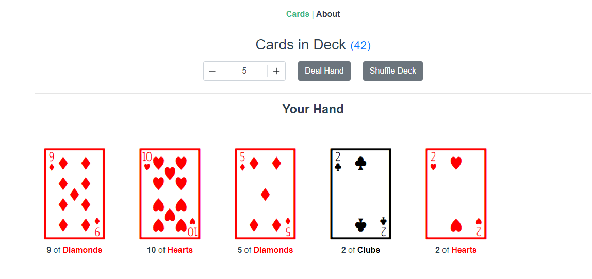
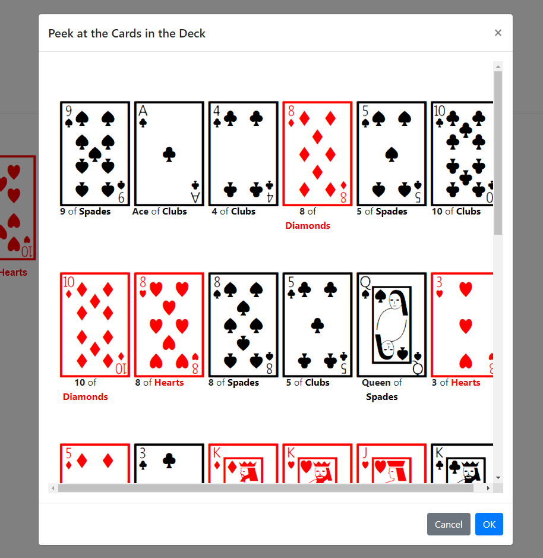

# flask-vue-test
Example Flask application using Vue.js instead of jinja templates for web app.  The Vue.js Application gets ran from Flask using a static directory.

## About the app
 This is a simple application that just deals the user playing cards.  The card deck is stored in the backend in Flask to maintain deck state (so users can't just refresh the app to get a new deck of cards).

This could easily be extended to make an actual card game.  Each unique player get's their own id and a deck of cards will be associated to that user and can request the dealer to deal cards:



The user can also cheat and hit the number of cards in deck hyperlink to peek at the rest of the cards in the deck:



If you don't like the order of the cards coming back, you can hit the `Shuffle Deck` Button to shuffle the remaining cards in the deck (not in your hand)

# Running From Flask
To actually run this application from flask, you'll need to run the [`run.py`](./run.py) script to start flask and then go to `http://localhost:5005/` in your browser (unless you changed the default port the app is running on)


## Project setup
```
npm install
```

- By default, the application will run on `http://localhost:5005/`, however, if you want to change this modify the [`config.json`](./config.json) file

### Compiles and hot-reloads for development
```
npm run serve
```

- Note: you only need to run the `serve` command if you want to modify the local dev instance of the vue app.  This is **not** what get's ran from the flask instance (but will use the flask service to fetch cards).  If you make changes to the vue app, you must run the `build` command below to recompile the production app that will get placed in the `static` flask folder.
 - in the [vue.config.js](./vue/vue.config.js) file, when the `NODE_ENV` is pointed to `production` (i.e. being ran from the flask app), the `publicPath` gets set to `./static/` to ensure the vue application is properly routed from the `static` folder of flask.

### Compiles and minifies for production
```
npm run build
```

* Use this command to recompile the app that gets launched flask.

### Customize configuration
See [Configuration Reference](https://cli.vuejs.org/config/).
